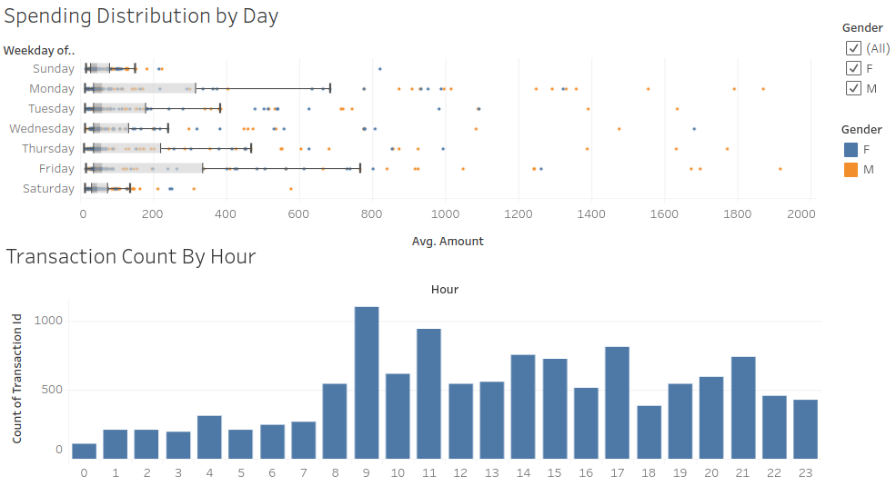
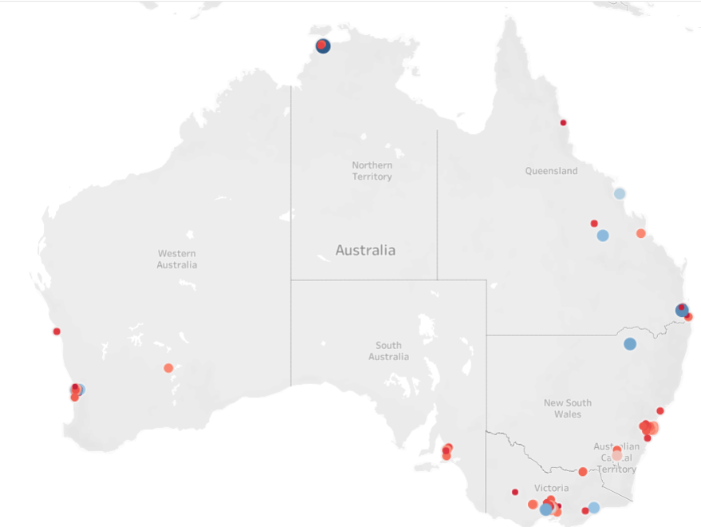
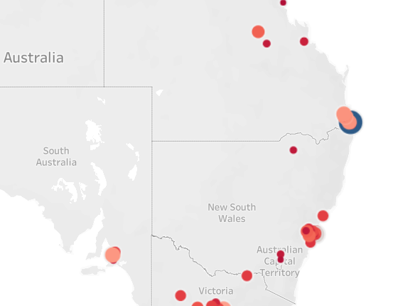
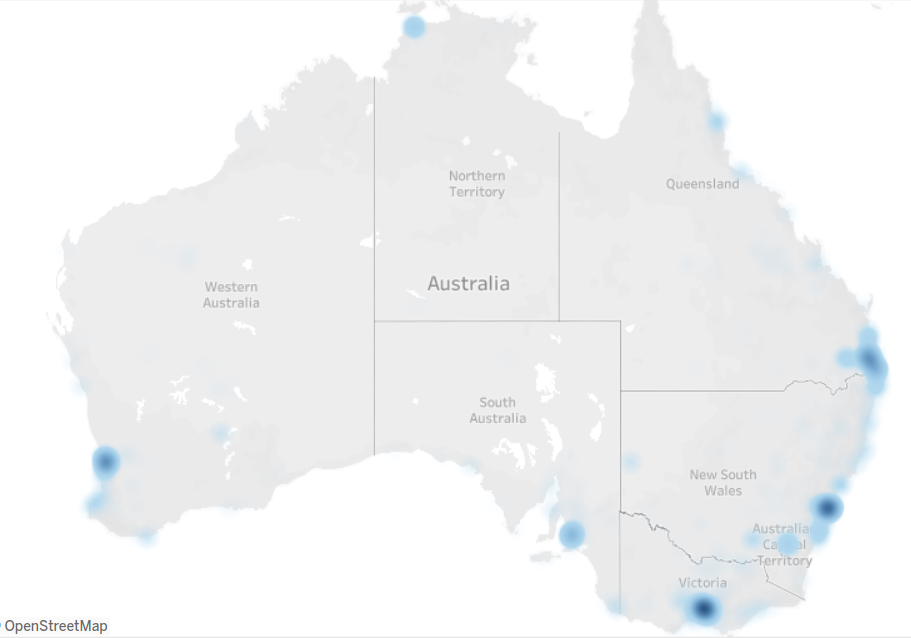

# ANZ
This projects contains task from the ANZ virtual internship programs.
## Contents

- [Directories](#dir)
- [Instalation](#data)
- [Task 1](#t1)
- [Result 1](#r1)
- [Task 2](#t2)
- [Result 2](#r2)

## Directories
    .
    ├── data        # folder containing the transaction data
    ├── static      # folder containing the static images used in README
    └── EDA         # folder containing the jupyter notebok for exploratory data analysis (EDA)

## Data

containing 3 months’ worth of transactions for 100 hypothetical customers. It contains purchases, recurring transactions, and salary transactions.

## Tasks 1

The goal of this project is to find intersting pattern or insight from the data exploratory
- Any data issues?
- What insight gain from the EDA?
- What insight can be gain from the location?
- Create a slide on 3 most interesting findings

## Result 1

The jupyter notebook is first used to explore and check whether the data have any issues.
The EDA shows that there are some missing values and multiple values exist in one column ex: long-lat, which should be separated.
Although there are missing values, it's a natural occurence based on the investigation. 
Since there is no heavy cleaning or preprocssing needed, I decided to move to Tableau. 

I believe that every tools have it's advantages and disadvantages. If ML, heavy cleaning and preprocessing needed, jupyter notebook would be better. However there are no coplex issues, Tableau would be more advantages for EDA. Tableau has the interactive EDA that makes it better gaining insights on the data.

The result explanation of the finding could be found on `ANZ Virtual Internship EDA.pdf`

From the image above, larger transaction occrus more during the weekdays. There are some huge transactions occuring in the weekdays.

The image above shows the location and intensity of the transaction. Darker blue means that the customer had larger average ammount spent, while darker red means otherwise. The Northen Territory shows that it has a customer with the higest average transaction amount.

The image above, shows the intensity of the transaction counts. A customer on NSW has the higest transaction count.

The last image shows the location and spread of the merchants. Most of the merchants are located in the high density populated area like Melbourne and Sydney.

More of the results could be found in the PDF.

## Tasks 2

## Result 2

